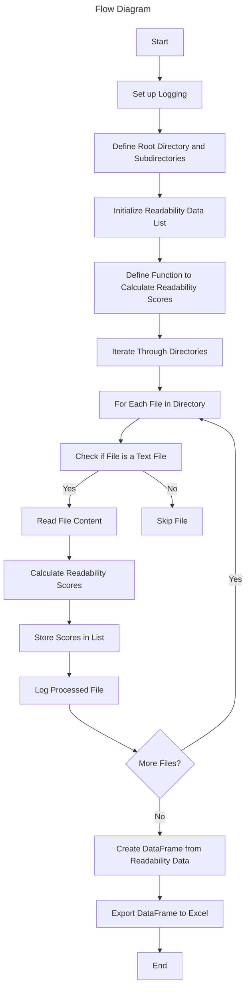
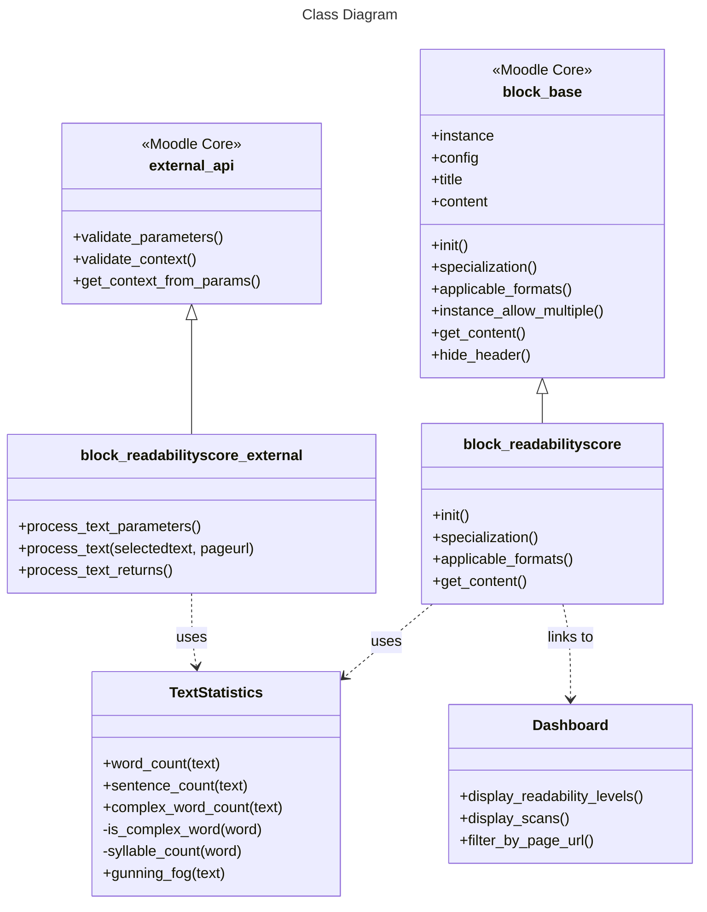
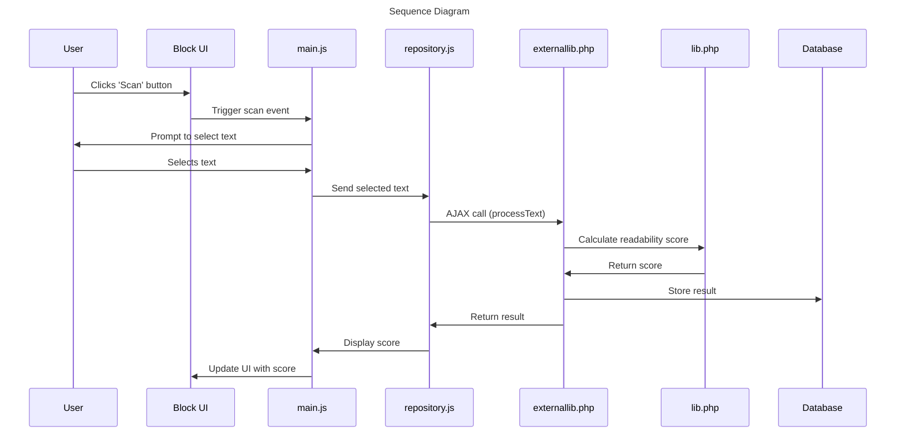

# Algorithm Evaluation

## Design Diagrams

```mermaid
---
title: Flow Diagram
---
graph TD
    A[Start] --> B[Set up Logging]
    B --> C[Define Root Directory and Subdirectories]
    C --> D[Initialize Readability Data List]
    D --> E[Define Function to Calculate Readability Scores]
    E --> F[Iterate Through Directories]
    F --> G[For Each File in Directory]
    G --> H[Check if File is a Text File]
    H -- Yes --> I[Read File Content]
    I --> J[Calculate Readability Scores]
    J --> K[Store Scores in List]
    K --> L[Log Processed File]
    H -- No --> M[Skip File]
    L --> N{More Files?}
    N -- Yes --> G
    N -- No --> O[Create DataFrame from Readability Data]
    O --> P[Export DataFrame to Excel]
    P --> Q[End]

```

```mermaid
---
title: Class Diagram
---
classDiagram
    class block_base {
        <<Moodle Core>>
        +instance
        +config
        +title
        +content
        +init()
        +specialization()
        +applicable_formats()
        +instance_allow_multiple()
        +get_content()
        +hide_header()
    }
    class block_readabilityscore {
        +init()
        +specialization()
        +applicable_formats()
        +get_content()
    }
    class TextStatistics {
        +word_count(text)
        +sentence_count(text)
        +complex_word_count(text)
        -is_complex_word(word)
        -syllable_count(word)
        +gunning_fog(text)
    }
    class block_readabilityscore_external {
        +process_text_parameters()
        +process_text(selectedtext, pageurl)
        +process_text_returns()
    }
    class external_api {
        <<Moodle Core>>
        +validate_parameters()
        +validate_context()
        +get_context_from_params()
    }
    class Dashboard {
        +display_readability_levels()
        +display_scans()
        +filter_by_page_url()
    }

    block_base <|-- block_readabilityscore
    block_readabilityscore ..> TextStatistics : uses
    external_api <|-- block_readabilityscore_external
    block_readabilityscore_external ..> TextStatistics : uses
    block_readabilityscore ..> Dashboard : links to

```

```mermaid
---
title: Sequence Diagram
---
sequenceDiagram
    participant User
    participant Block UI
    participant main.js
    participant repository.js
    participant externallib.php
    participant lib.php
    participant Database

    User->>Block UI: Clicks 'Scan' button
    Block UI->>main.js: Trigger scan event
    main.js->>User: Prompt to select text
    User->>main.js: Selects text
    main.js->>repository.js: Send selected text
    repository.js->>externallib.php: AJAX call (processText)
    externallib.php->>lib.php: Calculate readability score
    lib.php->>externallib.php: Return score
    externallib.php->>Database: Store result
    externallib.php->>repository.js: Return result
    repository.js->>main.js: Display score
    main.js->>Block UI: Update UI with score
```