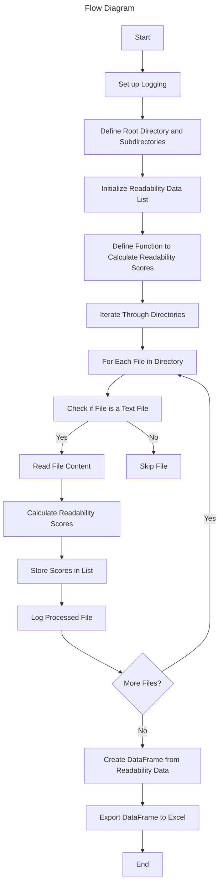
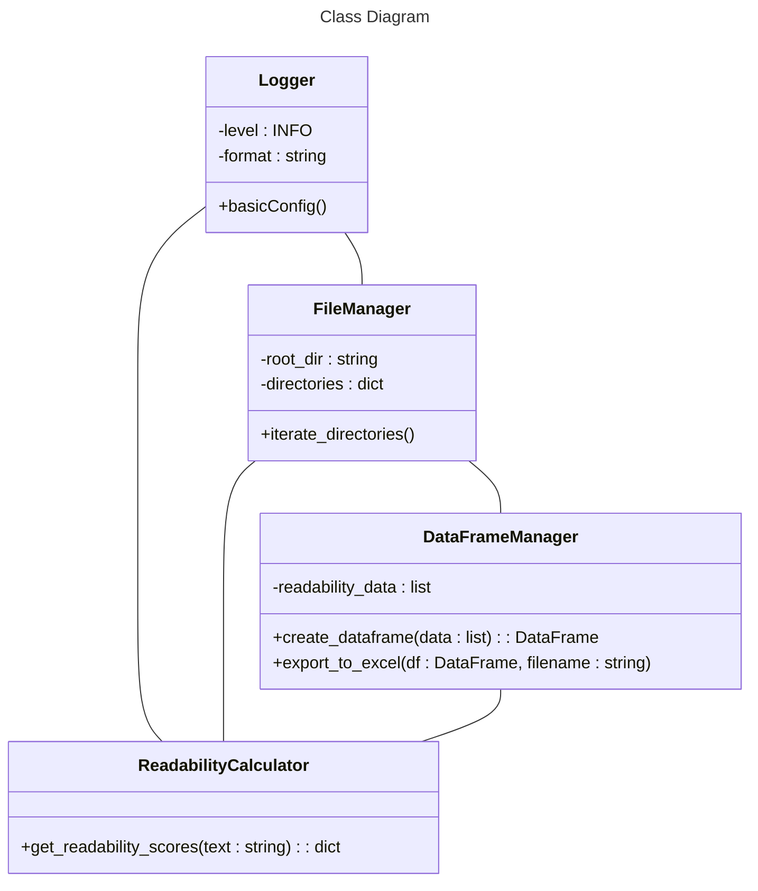

# Algorithm Evaluation

## Design Diagrams

```mermaid
---
title: Flow Diagram
---
graph TD
    A[Start] --> B[Set up Logging]
    B --> C[Define Root Directory and Subdirectories]
    C --> D[Initialize Readability Data List]
    D --> E[Define Function to Calculate Readability Scores]
    E --> F[Iterate Through Directories]
    F --> G[For Each File in Directory]
    G --> H[Check if File is a Text File]
    H -- Yes --> I[Read File Content]
    I --> J[Calculate Readability Scores]
    J --> K[Store Scores in List]
    K --> L[Log Processed File]
    H -- No --> M[Skip File]
    L --> N{More Files?}
    N -- Yes --> G
    N -- No --> O[Create DataFrame from Readability Data]
    O --> P[Export DataFrame to Excel]
    P --> Q[End]

```

```mermaid
---
title: Class Diagram
---
classDiagram
    class Logger {
        -level : INFO
        -format : string
        +basicConfig()
    }

    class FileManager {
        -root_dir : string
        -directories : dict
        +iterate_directories()
    }

    class ReadabilityCalculator {
        +get_readability_scores(text : string) : dict
    }

    class DataFrameManager {
        -readability_data : list
        +create_dataframe(data : list) : DataFrame
        +export_to_excel(df : DataFrame, filename : string)
    }

    Logger -- FileManager
    Logger -- ReadabilityCalculator
    FileManager -- ReadabilityCalculator
    FileManager -- DataFrameManager
    DataFrameManager -- ReadabilityCalculator

```