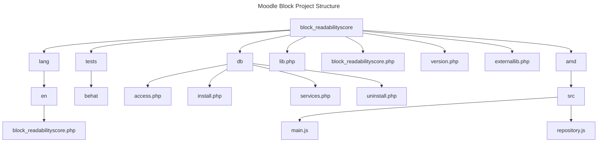
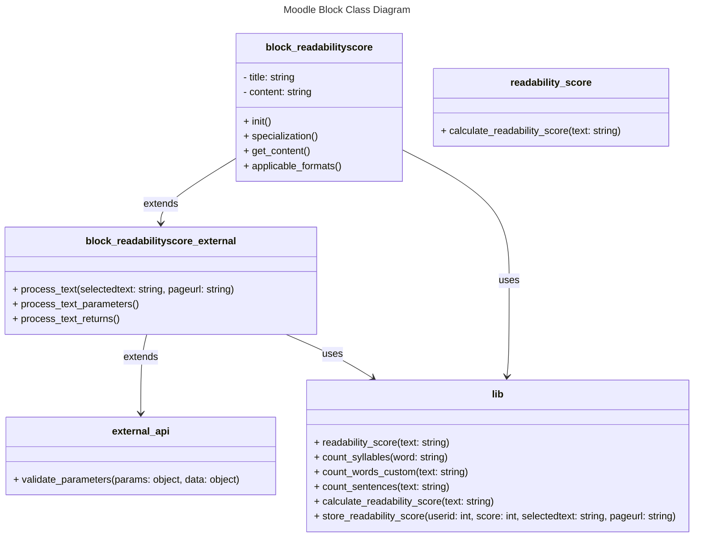
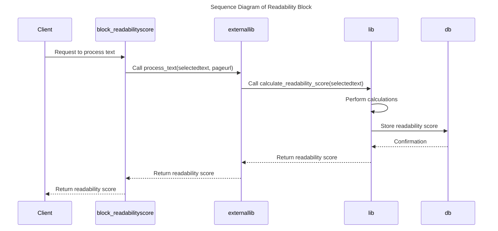
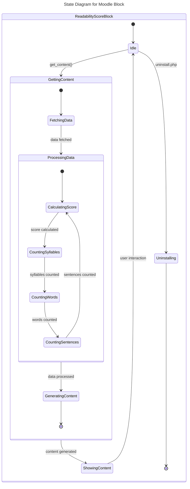
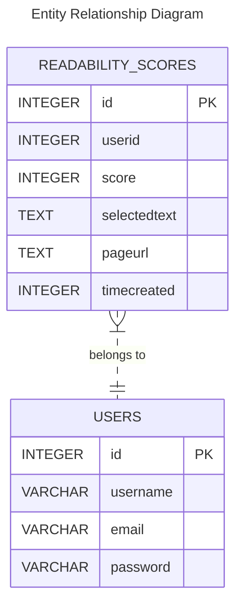
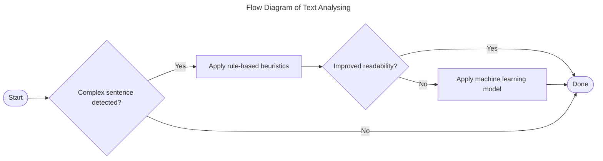
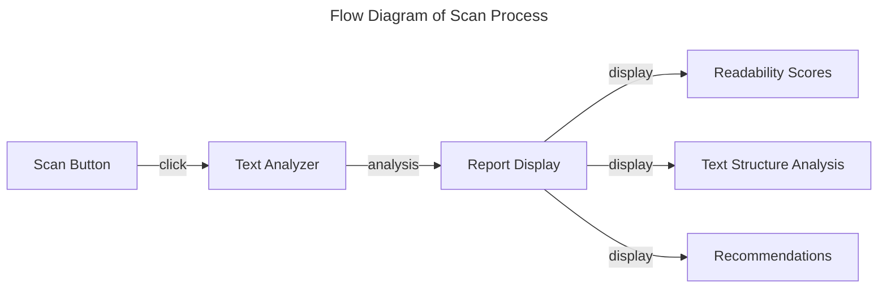
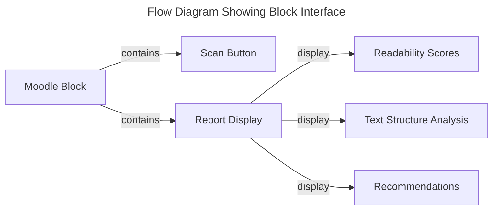

# Computing Project 2024

## Contents

- [Computing Project 2024](#computing-project-2024)
  - [Contents](#contents)
  - [Requirements Gathering](#requirements-gathering)
    - [Functional Requirements](#functional-requirements)
    - [Non-functional Requirements](#non-functional-requirements)
    - [User Requirements](#user-requirements)
  - [Analysis](#analysis)
  - [Design](#design)
    - [Tool Architecture](#tool-architecture)
    - [User Interfaces](#user-interfaces)
      - [Scan Button and Report Display](#scan-button-and-report-display)
      - [Moodle Block Interface](#moodle-block-interface)
  - [Implementation](#implementation)
  - [Testing](#testing)
  - [Evlauation](#evlauation)

## Requirements Gathering

### Functional Requirements

* Analise the readability of the content.
* Provide simplification recommendations.
* Display the analysis results and recommendations.

### Non-functional Requirements

* Performance: Handle large volumes of content.
* Security: Ensure the security of the users data.
* Usability: Provide an intuitive user interface.

### User Requirements

* Users should be be able to request content analysis.
* Users should be able to view the analysis results and recommendations.

## Analysis

## Design

### Tool Architecture

### User Interfaces

#### Scan Button and Report Display

#### Moodle Block Interface

## Implementation

## Testing

## Evlauation
