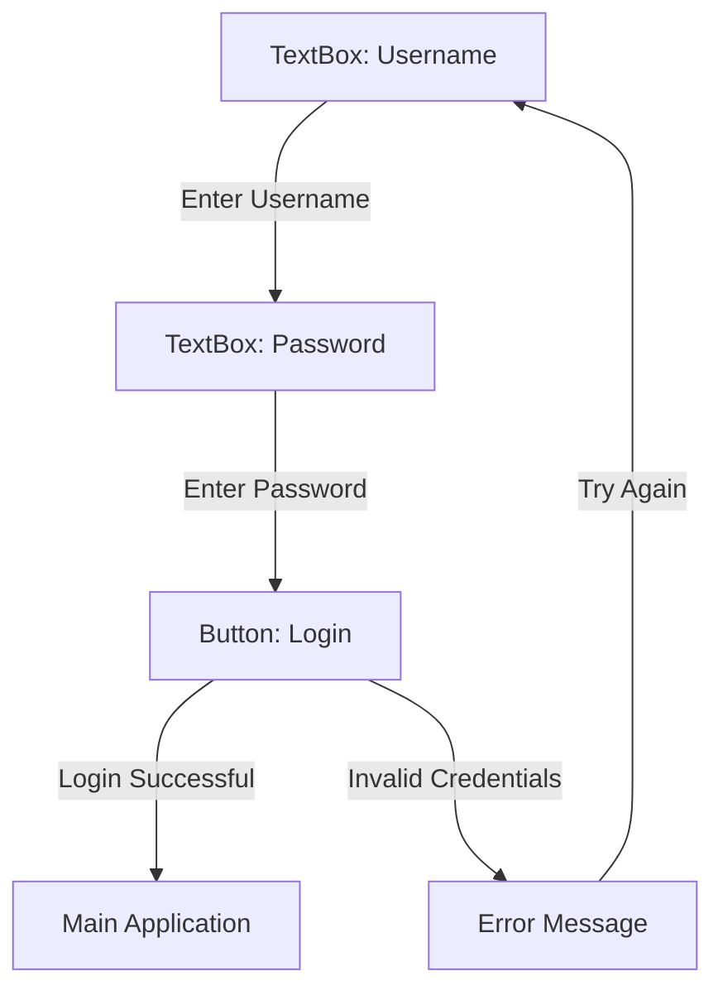

# Computing Project 2024

## Contents
- [Computing Project 2024](#computing-project-2024)
  - [Contents](#contents)
  - [Requirements Gathering](#requirements-gathering)
  - [Analysis](#analysis)
  - [Design](#design)
    - [User Interfaces](#user-interfaces)
      - [Login Page](#login-page)
  - [Implementation](#implementation)
  - [Testing](#testing)
  - [Evlauation](#evlauation)

## Requirements Gathering 

## Analysis

## Design
### User Interfaces
#### Login Page

## Implementation

## Testing

## Evlauation